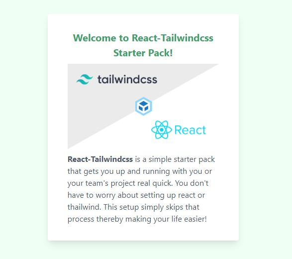

# React-Tailwindcss Starter Pack

> A simple React, Tailwind starter pack that helps you get up and running with you or your team's react project real quick.



## Installation

```sh
git clone git@github.com:Raymond-Osy/React-Tailwindcss-Starter-Pack.git
```

Change directory

```sh
cd React-Tailwindcss-Starter-Pack
```

Install Package dependencies

```sh
npm install
```

Run the application

```sh
npm start
```

Run test

```sh
npm run test
```

## Tailwind
To add css as part of the build process, use this command:

```sh
npm run build:css
```

This builds the Tailwind derivatives contained in the `assets/tailwind.css` into the `assets/main.css` which will be used in styling the application.

## Meta

Raymond Akalonu– [www.raymondakalonu.com](https://www.raymondakalonu.com) – raymond.akalonu@gmail.com

Distributed under the MIT license. See ``LICENSE`` for more information.

## Contributing

1. Fork it (<https://github.com/Raymond-Osy/React-Tailwindcss-Starter-Pack/fork>)
2. Create your feature branch (`git checkout -b feature/fooBar`)
3. Commit your changes (`git commit -am 'Add some fooBar'`)
4. Push to the branch (`git push origin feature/fooBar`)
5. Create a new Pull Request to branch `feature/develop`

## Security Vulnerabilities

If you discover a security vulnerability within React-tailwind starter pack, please raise an issue or send an e-mail to me raymond.akalonu@gmail.com. All security vulnerabilities will be promptly addressed.

## Credits

* [TailwindCSS](https://tailwindcss.com/)
* Kingdom Orjiewuru -React Webpack Starter

## Wanna express appreciation?

How about you star the github repo, it'll definitely go a long way. You can also share the link to this repo to your individual communities.

Don't forget to [follow me on twitter!](https://twitter.com/rayz_of_daimond)

Thanks! Raymond.

## License

The MIT License (MIT). Please see [License File](https://github.com/kingisaac95/react-tailwindcss-starter-pack/blob/master/LICENSE) for more information.